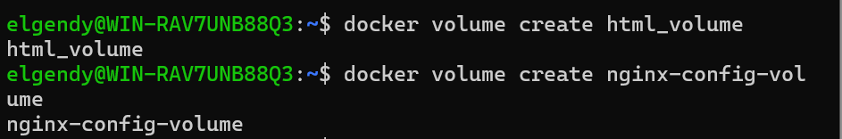
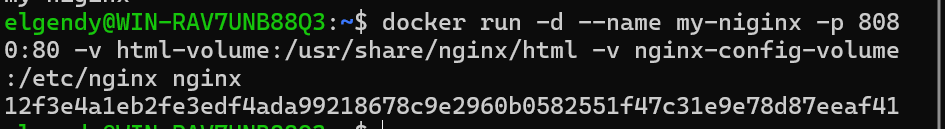
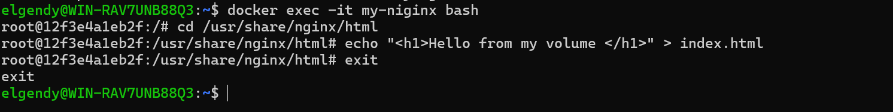
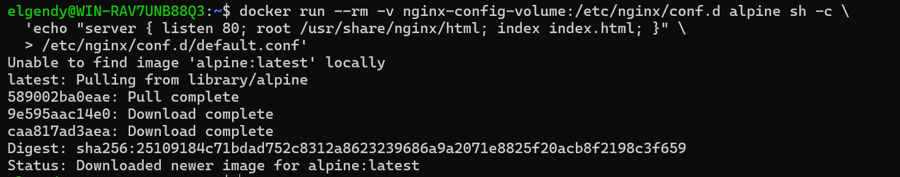
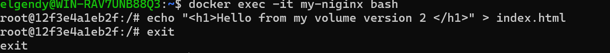
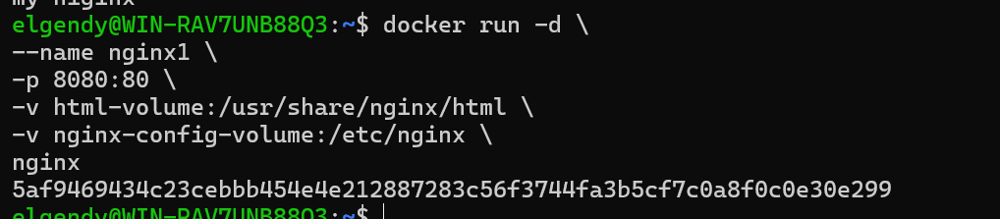
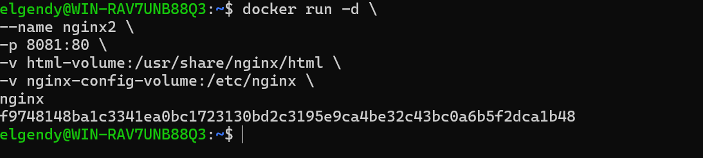
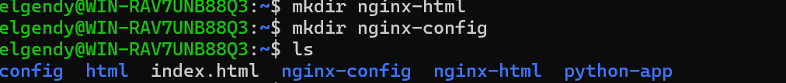
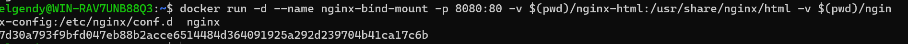
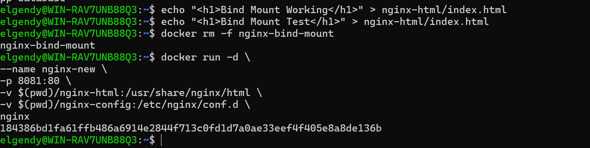

# Problem 1

## create 2 volume

## run the container 

## • Volume1 for containing static html file 

## • Volume2 for containing nginx configuration 

## • Edit the html content 

## • Remove the container 

## Run a new 2 containers with the following:
 # o Attach the two volumes that were attached to the previous container
 # using volume mount
 # o Map port 80 to port 8080 on you host machine
 # o Access the html files from your browser

 

# problem 2

• Run a container Nginx with name nginx-bind-mount and attach 2 volumes
using bind mount under any paths
• Remove the container
• Run a new container with the following:
o Attach the two volumes that were attached to the previous container
o Check the old data in the new containers

